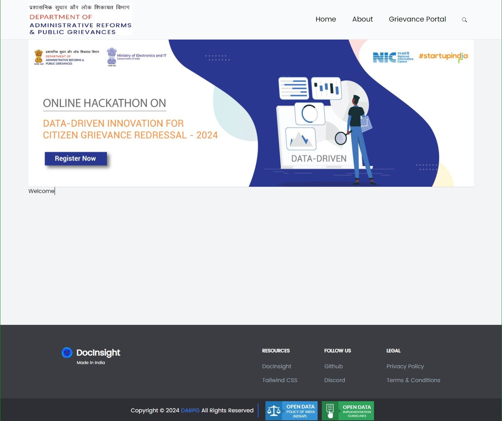
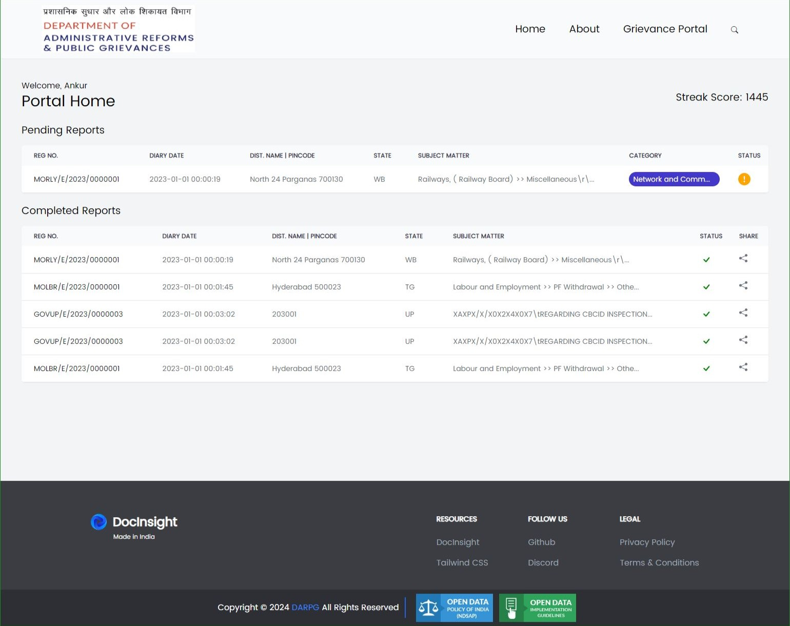
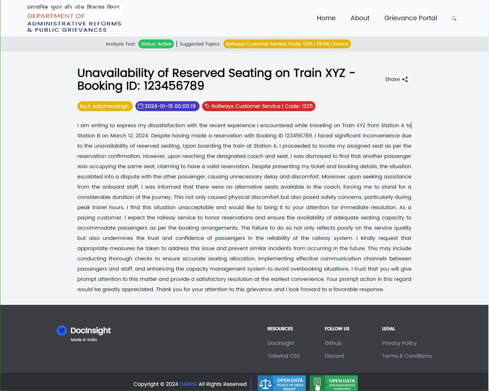
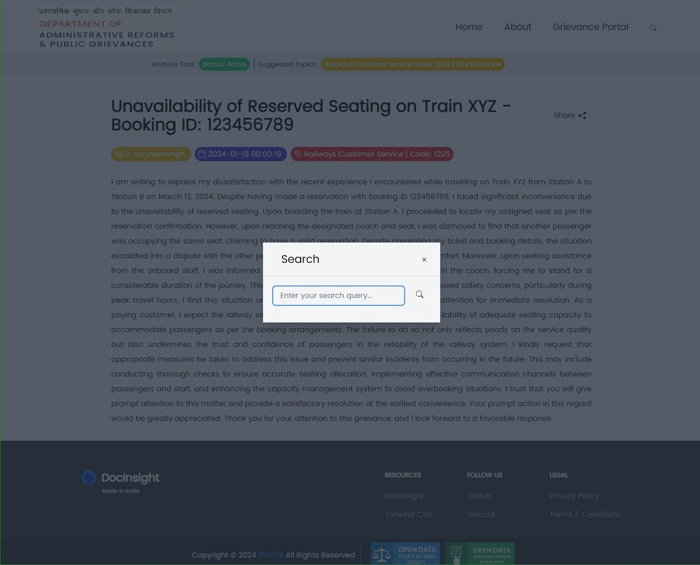
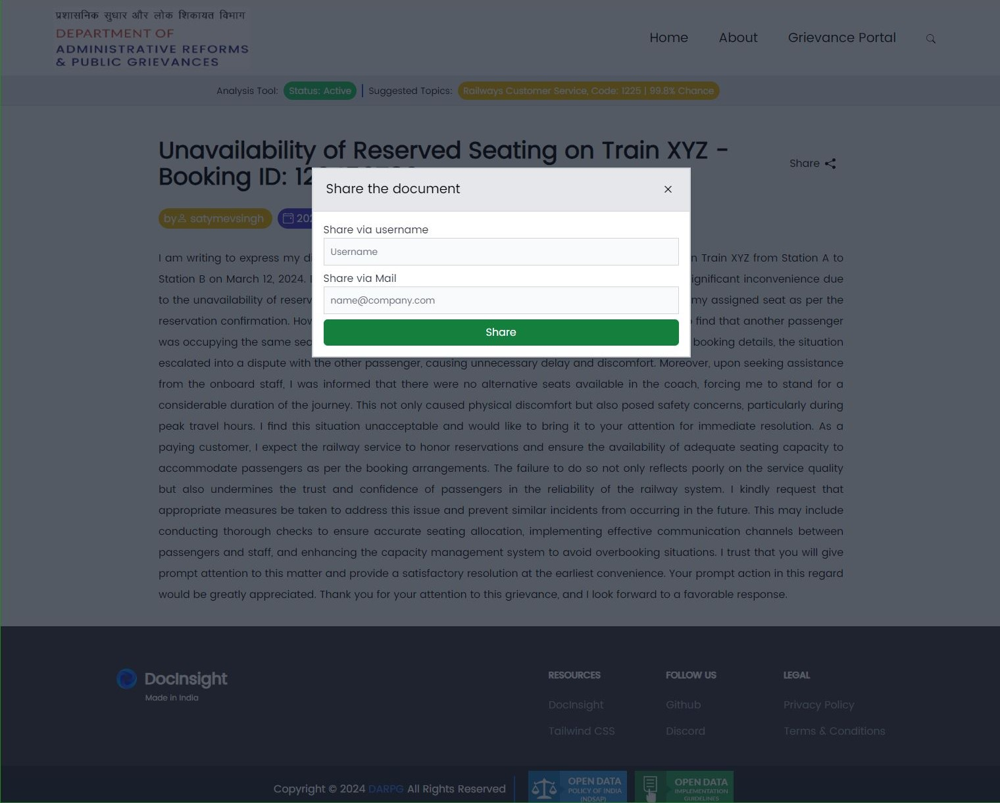
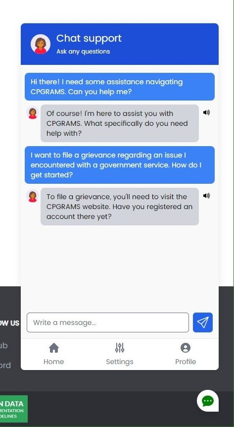

# DocInsight: AI/ML-driven Grievance Report Categorization and Sharing System
## Solution for : Problem Statement 1
## Introduction
DocInsight is an AI/ML-driven system designed to streamline the process of handling and categorizing grievance reports received through CPGRAMS (Centralized Public Grievance Redress and Monitoring System). The system employs advanced natural language processing (NLP) techniques to automatically categorize grievance reports and share them with last-mile officers concerned. Additionally, it provides monitoring and tracking functionalities to ensure efficient resolution of grievances.

## Features
- **Auto-Categorization:** Utilizes topic clustering and modeling techniques to automatically categorize received grievance reports based on their content.
- **Last-Mile Officer Integration:** Shares categorized grievance reports with registered last-mile officers, ensuring timely attention to relevant issues.
- **Monitoring and Tracking:** Provides tools for monitoring and tracking the status of grievance reports, facilitating efficient resolution and follow-up.
- **User Authentication:** Secure user authentication mechanism to ensure authorized access for registered officials and administrators.
- **Dashboard Interface:** User-friendly dashboard interface for easy navigation and interaction with the system.
- **Feedback Mechanism:** Enables last-mile officers to provide feedback on resolved grievances, facilitating continuous improvement of the system.

## Technologies Used
- **Django:** Python-based web framework for building the application backend.
- **Scikit-learn:** Python library for implementing machine learning algorithms, used for topic clustering and modeling.
- **NLTK (Natural Language Toolkit):** Python library for natural language processing tasks, such as tokenization and text preprocessing.
- **SQLite:** Lightweight relational database management system for data storage.
- **HTML/CSS/JavaScript:** Frontend technologies for building the user interface and enhancing user experience.
- **Docker:** Containerization tool for packaging the application and its dependencies into containers for easy deployment.

## Installation and Setup
1. Clone the repository from GitHub: `git clone https://github.com/r3tr056/darpg_hackathon.git`
2. Navigate to the project directory: `cd darpg_hackathon`
3. Create a virtual environment: `python -m venv venv`
4. Activate the virtual environment:
   - On Windows: `venv\Scripts\activate`
   - On macOS and Linux: `source venv/bin/activate`
5. Install dependencies: `pip install -r requirements.txt`
6. Move the the Project Root: `cd darpg`
6. Apply database migrations: `python manage.py migrate`
7. Run the development server: `python manage.py runserver`
8. Access the application at `http://localhost:8000` in your web browser.

## Usage
1. **User Registration:** Users can register as last-mile officers or administrators with appropriate permissions.
2. **Grievance Report Submission:** Citizens can submit grievance reports through the CPGRAMS portal or other channels.
3. **Auto-Categorization:** The system automatically categorizes received grievance reports using AI/ML techniques.
4. **Sharing with Last-Mile Officers:** Categorized grievance reports are shared with registered last-mile officers based on their areas of expertise.
5. **Monitoring and Tracking:** Last-mile officers can monitor and track the status of assigned grievance reports through the dashboard.
6. **Resolution and Feedback:** Last-mile officers resolve grievances and provide feedback on the outcome, facilitating continuous improvement.

## Screenshots

### Homepage

### Dashboard Portal

### Report Details Page

### Search

### Share

# AI/ML-driven Chatbot: Grievance Resolution Assistant

## Solution for Problem Statement 2

DocInsight incorporates an AI/ML-driven chatbot specifically designed to assist citizens in resolving common queries related to filing grievances on the CPGRAMS portal. This chatbot aims to streamline the grievance submission process, provide guidance on navigating the portal, and expedite the resolution of citizen grievances.

### Features

- **Natural Language Understanding:** Utilizes advanced natural language processing (NLP) techniques to understand and interpret user queries accurately.
  
- **Multilingual Support:** Provides support for multiple languages, allowing users to interact with the chatbot in their preferred language for enhanced accessibility and inclusivity.

- **Text-to-Speech:** Offers text-to-speech functionality to convert chatbot responses into spoken language, catering to users with visual impairments or those who prefer auditory interaction.

- **Query Resolution:** Provides instant responses to common queries regarding the CPGRAMS portal, grievance filing procedures, document requirements, etc.

- **Step-by-Step Guidance:** Offers step-by-step guidance to users on how to navigate the CPGRAMS portal, complete grievance forms, attach documents, etc.

- **Error Handling:** Capable of handling user errors and misconceptions gracefully, guiding users towards the correct procedures and information.

- **Personalized Assistance:** Offers personalized assistance based on the user's specific query or issue, ensuring a tailored and efficient resolution process.

- **Continuous Learning:** Incorporates machine learning algorithms to continuously learn from user interactions and improve response accuracy and relevance over time.

### Usage

Users can interact with the Grievance Resolution Assistant chatbot through the DocInsight interface. Simply click on the chatbot icon or designated section to initiate a conversation. Users can then type or speak their queries related to the CPGRAMS portal, grievance filing process, or any other relevant topics. The chatbot will provide instant responses and guidance to assist users in resolving their queries effectively.

### Example Queries

- "How do I file a grievance on CPGRAMS?"
- "What documents are required to submit a grievance?"
- "Can you guide me through the grievance filing process?"
- "I'm having trouble attaching documents to my grievance. What should I do?"
- "What is the status of my submitted grievance?"

### Screenshots

The Grievance Resolution Assistant chatbot enhances the user experience of DocInsight by providing immediate assistance and guidance to citizens, ensuring a smooth and efficient grievance submission process on the CPGRAMS portal.

## Contributing
Contributions to DocInsight are welcome! Please feel free to submit bug reports, feature requests, or pull requests through GitHub.

## Acknowledgements
- This project was developed as part of the DARPG hackathon 2024.

---